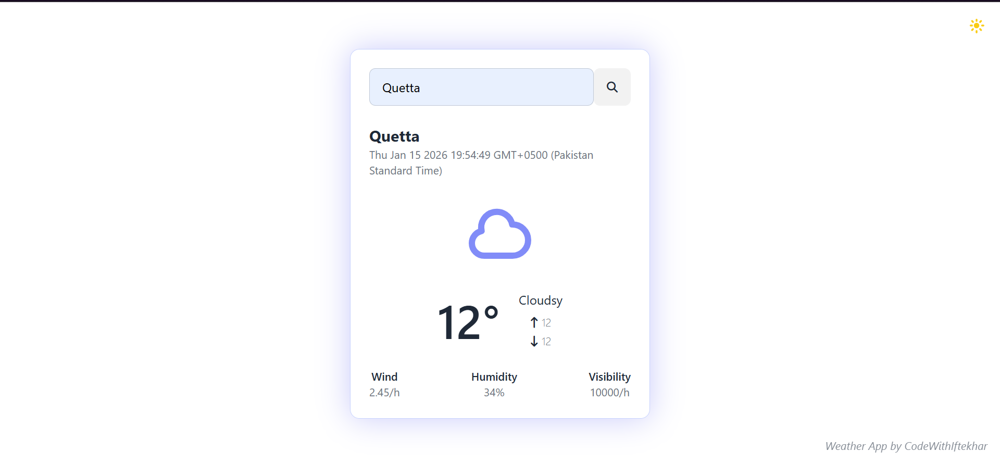
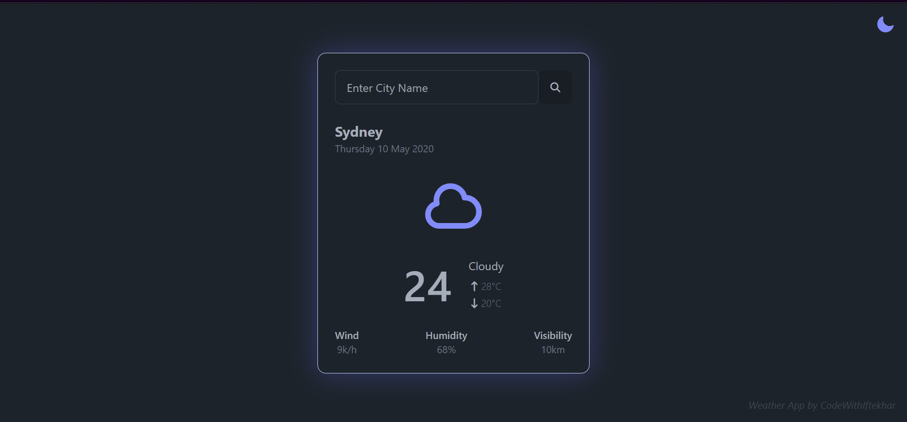

# 🌦 Weather App

A simple and clean **Weather Application** built using **HTML, Tailwind CSS (DaisyUI)**, and **JavaScript**, powered by the **OpenWeatherMap API**.  
It allows users to search for any city and view real-time weather information with a **day/night mode toggle**.

---

## ✨ Features

- Search weather by city name  
- Displays temperature, min/max temperature  
- Shows weather condition (cloudy, rain, clear, etc.)  
- Wind speed, humidity & visibility  
- Day / Night mode toggle  
- Clean, minimal UI with glowing card effect  

---

## Theme Preview

### Light Mode


### Night Mode


---

## 🛠 Technologies Used

- **HTML5**
- **Tailwind CSS**
- **DaisyUI**
- **JavaScript (Vanilla)**
- **OpenWeatherMap API**

---

## 📂 Project Structure

```
WEATHER-APP/
│
├── images/
│   ├── clear.png
│   ├── clouds.png
│   ├── drizzle.png
│   ├── favicon.png
│   ├── humidity.png
│   ├── light_mode.png
│   ├── mist.png
│   ├── night_mode.png
│   ├── rain.png
│   ├── search.png
│   ├── snow.png
│   └── wind.png
│
├── index.html
├── script.js
├── tailwind.config.js
└── README.md
```

---

## How to Run the Project

1. Clone or download the repository
2. Open `index.html` in your browser
3. Enter a city name and click the search button

> ⚠ Make sure you have an active internet connection (API dependency)

---

## API Used

* **OpenWeatherMap API**
  [https://openweathermap.org/api](https://openweathermap.org/api)

---

## 📌 Notes

* Temperature units are in **Celsius**
* Visibility is shown in **kilometers**
* The UI theme switches using DaisyUI’s `data-theme`

---

## Credits

- Original project code by **CodeWithIftekhar**
- Enhancements, UI improvements, documentation, and licensing by **zuni-developer**

---